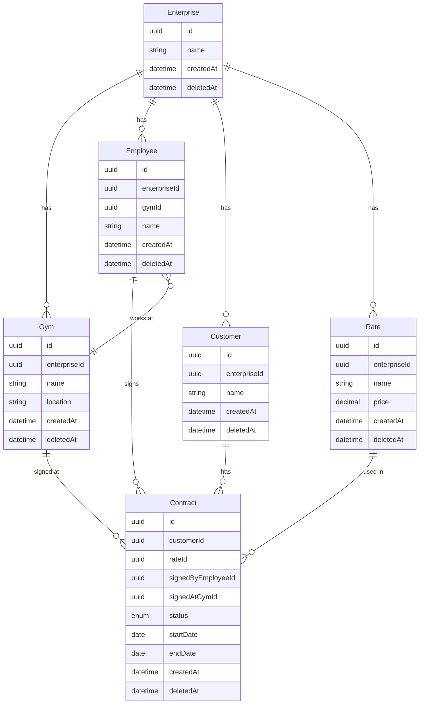

# Domain Model

This folder contains the domain model for the Gym Enterprise application in formats you can edit and extend.

## Files

| File | Purpose |
|------|--------|
| `domain-model.puml` | **PlantUML** class diagram – edit this for the canonical model |
| This file | **Mermaid** diagram below (viewable in GitHub/GitLab and many Markdown previews) |

## How to work with the diagram

- **PlantUML**  
  - Edit `domain-model.puml` in any text editor.  
  - View/render with: [PlantUML Server](https://www.plantuml.com/plantuml/uml), VS Code extension “PlantUML”, or IntelliJ PlantUML plugin.  
  - Export to PNG/SVG from the same tools for docs or draw.io.

- **draw.io**  
  - In draw.io: *Arrange → Insert → Advanced → PlantUML* and paste the contents of `domain-model.puml`, or  
  - Recreate the diagram manually using the Mermaid/PlantUML as reference – good if you prefer visual editing.

- **Mermaid** (below)  
  - Copy into any Markdown that supports Mermaid (e.g. `README.md`, `docs/*.md`) for quick viewing.  
  - Edit the code block to keep it in sync with the PlantUML when you change the model.

## Mermaid version (quick view)

## Main domain rules (from requirements)

- **Enterprise** is the tenant: one app instance per enterprise; it has gyms, employees, customers, and rates.
- **Rates** are global to the enterprise (same rates in all gyms).
- **Contract** = one customer enrolling under one rate, signed by one employee at one gym. Status can be ACTIVE or FINISHED.
- A **customer** can only be (soft-)deleted after all their contracts are FINISHED.
- **Employee “recruitment”** = count of contracts where that employee is `signedBy` (per month for the ranking).
- All entity deletion is **logical** (e.g. `deletedAt`); no physical delete for domain entities.
